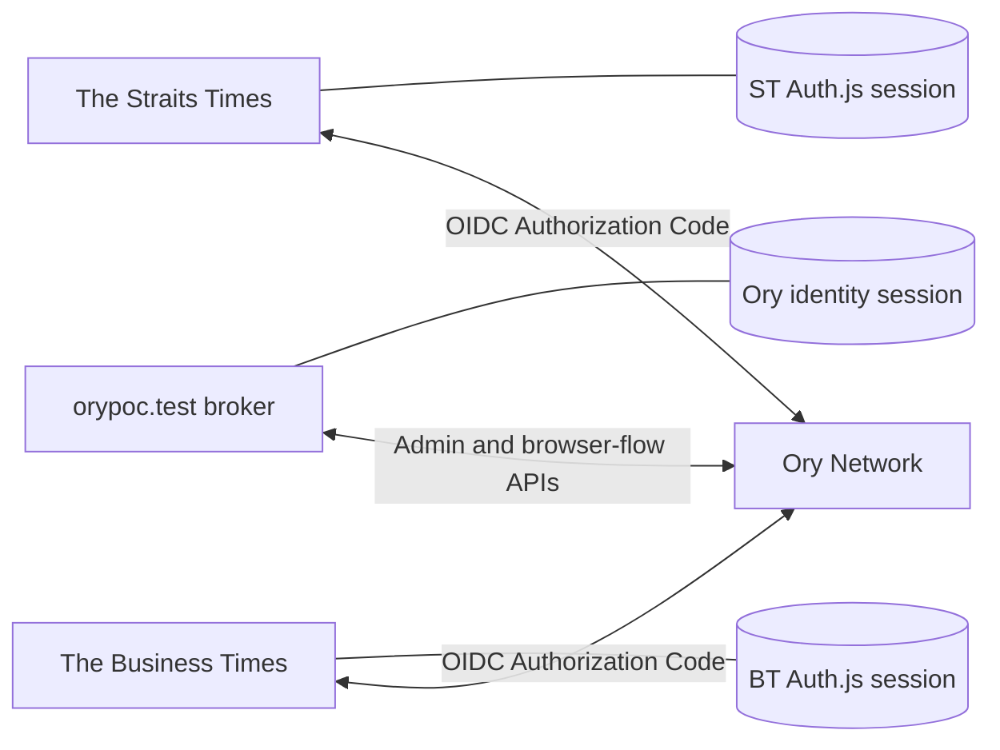
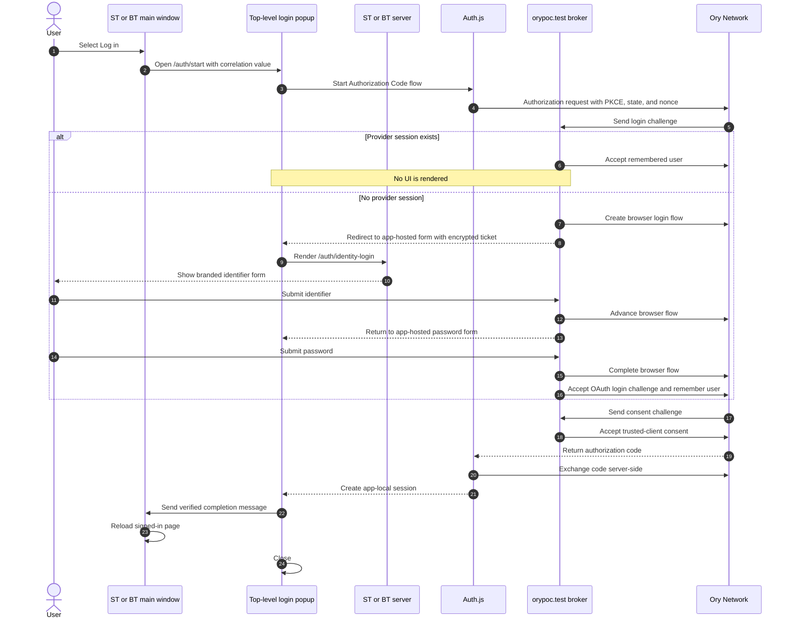
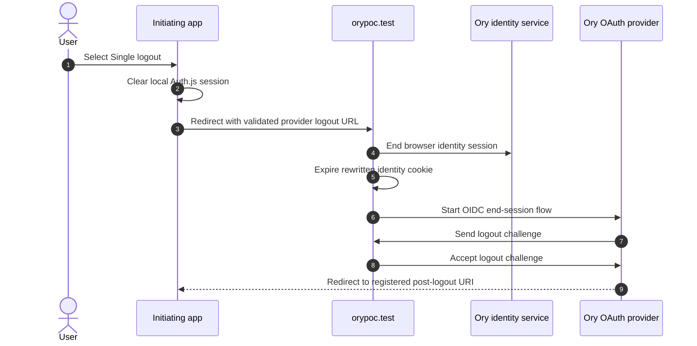

# Single Sign-On and App-Hosted Login

The portal, The Straits Times, and The Business Times use the same Ory OAuth2/OpenID Connect (OIDC) provider. Each application owns its local session and login presentation, while Ory provides the shared identity and provider sessions.

The implementation has these user-facing rules:

- Login starts only after the user selects **Log in**.
- A remembered IdP session completes login without showing a form.
- If no IdP session exists, the popup renders a branded form on the originating application domain.
- Ory-hosted login and logout pages are never shown.
- **Log out** clears only the current application's session.
- **Single logout** clears the current application and central Ory sessions.

## Domains and Sessions

| Domain | Responsibility | Session |
| --- | --- | --- |
| `https://orypoc.test` | Ory browser-flow broker and OAuth login, consent, and logout handlers | Central Ory identity session |
| `https://straitstimes.test` | The Straits Times application and branded popup form | ST Auth.js session |
| `https://businesstimes.test` | The Business Times application and branded popup form | BT Auth.js session |
| Ory Network issuer | OAuth2/OIDC provider and identity APIs | Remembered OAuth login session |

The Auth.js cookies are independent and are not shared across domains. Signing in to ST does not create a BT cookie. When the user later selects **Log in** on BT, the remembered provider session allows BT to create its own cookie without another credential prompt.



## Cookie Model

The flow is designed for Safari Intelligent Tracking Prevention and browsers that block third-party cookies.

- Login runs in a top-level popup or top-level same-tab navigation.
- The implementation does not use login iframes.
- The browser does not make cross-origin credentialed `fetch` requests to Ory.
- The news applications never read the central Ory cookie.
- Ory browser-flow API calls are made server-to-server by `orypoc.test`.
- Central cookies are written by an `orypoc.test` response while it is the top-level popup origin.
- Cookies use `SameSite=Lax`; the design does not depend on `SameSite=None` bypassing browser privacy controls.

Front-channel logout may still use provider-generated iframes to notify other applications. Clearing the initiating application's local session and the central sessions does not depend on those iframes.

## Login Overview

The news site opens a popup and starts the normal Auth.js Authorization Code flow. Ory sends its login challenge to `orypoc.test/oauth2/login`.

The portal login handler checks the provider login request:

- If Ory has remembered the user, the handler accepts the challenge immediately. No login UI is rendered.
- If no remembered session exists, the handler creates an Ory **browser login flow** server-side and sends the popup back to an app-hosted form.



## App-Hosted Form

The form is rendered at the origin that initiated login:

- `https://straitstimes.test/auth/identity-login`
- `https://businesstimes.test/auth/identity-login`

The pages render only the supported identifier-first password flow. They do not render arbitrary Ory scripts, anchors, or provider-controlled HTML.

The form submits using a top-level POST to:

```text
https://orypoc.test/oauth2/identity-login
```

The broker submits the credentials to the Ory browser flow server-to-server. On validation errors, it redirects the popup back to the originating app form with the Ory error message. On success, it accepts the pending OAuth login challenge and writes the returned Ory session and CSRF cookies on the portal response.

Although the visible form is app-hosted, credentials pass through the portal broker. They must never be logged, persisted, or included in URLs.

## Login Ticket

The portal passes browser-flow state to the news application in an encrypted and authenticated ticket. `AUTH_SECRET` is hashed to derive the AES-256-GCM key.

The ticket contains:

- OAuth login challenge
- Exact permitted client origin
- Ory browser-flow ID
- Ory double-submit CSRF cookie and token
- Expiration time
- Identifier after the identifier-first step

Tickets expire after five minutes. Encryption prevents the news page or a user from reading or modifying the challenge and CSRF values. The portal derives the destination from a fixed OAuth client ID-to-origin mapping; it does not trust a browser-supplied return URL.

## Popup Completion

ST and BT use different correlation values:

- ST uses a 48-character random attempt value.
- BT uses a UUID nonce.

The completion route sends `window.postMessage` only after the app-local Auth.js session exists. The opener accepts the message only when all of these match:

- `event.origin`
- `event.source`
- Message type
- Attempt or nonce value

Login continues in the same tab when:

- The device uses a coarse pointer or a narrow viewport.
- The browser blocks the popup.
- The popup closes before completion.
- Login takes longer than 120 seconds.

The same OIDC and app-hosted form sequence applies in the fallback tab.

## Auto Login

Auto Login is user initiated. Applications do not silently probe Ory in an iframe or background request.

After one successful login, Ory remembers the accepted OAuth login for 72 hours. When the user selects **Log in** on another application, Ory marks the login request as skippable. `orypoc.test/oauth2/login` accepts the remembered subject, and the new application creates its local Auth.js session without rendering a form.

## Logout

| Action | Result |
| --- | --- |
| **Log out** / **Sign out here** | Clears only the current application's Auth.js session. Central Ory sessions remain available, so a later user-initiated login can auto-complete. |
| **Single logout** / **Sign out everywhere** | Clears the initiating app session, the central Ory identity session, and the provider login session. Provider front-channel logout of other app sessions is best-effort. |

### Local Logout

The current app calls Auth.js `signOut` and redirects to its own public HTTPS home page. It does not call the Ory end-session endpoint.

### Global Logout



The custom `/oauth2/logout` handler accepts trusted logout challenges, so Ory's hosted logout confirmation page is not shown. Trusted OAuth clients must enable **Skip logout consent**.

Post-logout redirects use only these registered HTTPS origins:

- `https://orypoc.test/`
- `https://straitstimes.test/`
- `https://businesstimes.test/`

## Required Ory Configuration

Create a separate Ory OAuth client for each application. Configure each client with its own:

- Client ID and client secret
- Auth.js secret
- Callback URI
- Front-channel logout URI
- Post-logout URI

For each trusted first-party client, enable:

- Authorization Code grant
- PKCE
- Skip consent
- Skip logout consent
- Front-channel logout

Configure the project with:

- Login URL: `https://orypoc.test/oauth2/login`
- Consent URL: `https://orypoc.test/oauth2/consent`
- Logout URL: `https://orypoc.test/oauth2/logout`
- `https://orypoc.test/auth/logout` in the identity allowed return URLs
- Identity and OAuth cookies set to `SameSite=Lax`
- Public cross-origin credential CORS disabled for this flow

The portal requires `ORY_PROJECT_API_TOKEN` for the Ory admin APIs. Each application requires its own `ORY_CLIENT_ID`, `ORY_CLIENT_SECRET`, and `AUTH_SECRET`.

## Security Invariants

- Accept OAuth, consent, and logout redirects only from the configured Ory issuer.
- Bind app-form tickets to an exact trusted OAuth client origin.
- Encrypt and authenticate all ticket contents.
- Reject expired or malformed tickets.
- Keep Auth.js PKCE, state, and nonce checks enabled.
- Preserve Ory's double-submit CSRF cookie and token.
- Never log passwords, ticket plaintext, Ory cookies, authorization codes, or client secrets.
- Set authentication responses to `Cache-Control: no-store`.
- Do not add iframe-based session probing or cross-origin credentialed browser requests.
- Do not fall back to Ory-hosted login or logout pages.

## Main Implementation Files

- [`app/oauth2/login/route.ts`](app/oauth2/login/route.ts): provider-session check and browser-flow creation
- [`app/oauth2/identity-login/route.ts`](app/oauth2/identity-login/route.ts): identifier/password browser-flow broker
- [`app/oauth2/consent/route.ts`](app/oauth2/consent/route.ts): trusted-client consent
- [`app/oauth2/logout/route.ts`](app/oauth2/logout/route.ts): custom OAuth logout challenge acceptance
- [`app/auth/logout/route.ts`](app/auth/logout/route.ts): central identity-session logout
- [`lib/login-ticket.ts`](lib/login-ticket.ts): encrypted login handoff tickets
- [`oauth-apps/straitstimes/app/auth/identity-login/page.tsx`](oauth-apps/straitstimes/app/auth/identity-login/page.tsx): ST login form
- [`oauth-apps/businesstimes/app/auth/identity-login/page.tsx`](oauth-apps/businesstimes/app/auth/identity-login/page.tsx): BT login form
- [`oauth-apps/straitstimes/app/auth`](oauth-apps/straitstimes/app/auth): ST OIDC start, completion, and logout routes
- [`oauth-apps/businesstimes/app/auth`](oauth-apps/businesstimes/app/auth): BT OIDC start, completion, and logout routes
