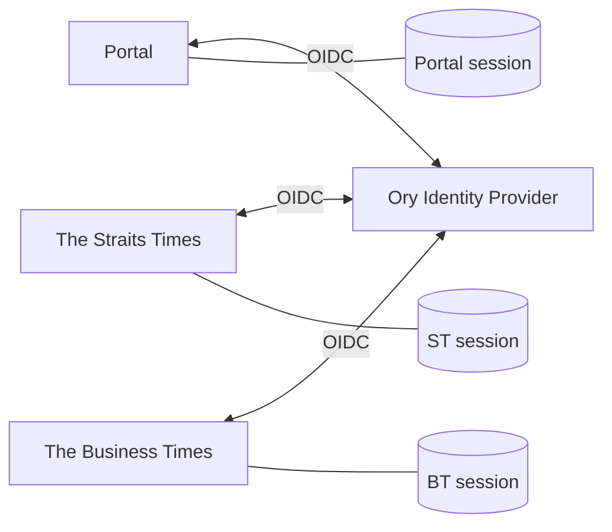
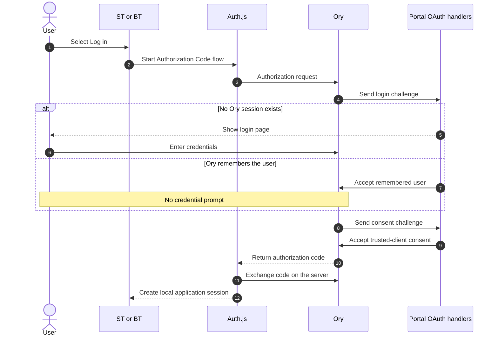
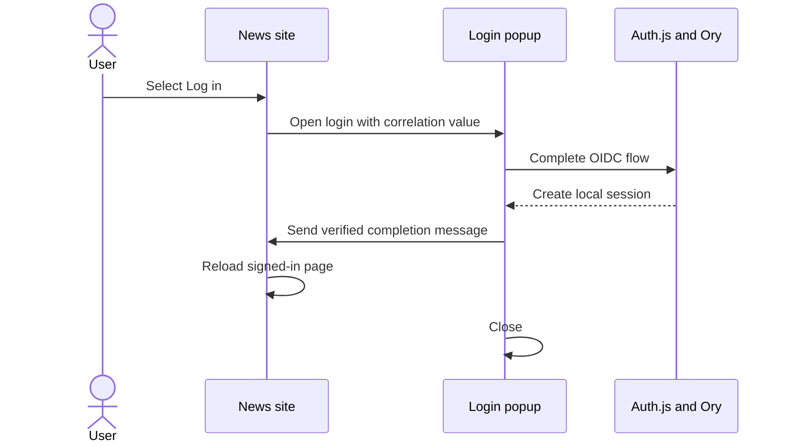

# Single Sign-On and Auto Login

The portal, The Straits Times, and The Business Times use the same Ory OAuth2/OpenID Connect (OIDC) provider.

**Auto Login** means that after a user signs in to Ory once, they can select **Log in** on another application without entering their credentials again. Login is still user initiated; it does not happen silently in the background.

## How It Works

Each application has its own Auth.js session cookie. These cookies are not shared across domains.

Ory keeps the central identity session. When another application starts an OIDC login, Ory recognizes the existing session and returns the user without showing the login form again. The new application then creates its own local session.

## Login Sequence

The first application may require the user to enter credentials. Later applications can reuse the remembered Ory login.

The portal handles Ory's login and consent challenges at:

- `/oauth2/login`
- `/oauth2/consent`

The login is remembered for 72 hours. Consent is skipped only for configured trusted first-party clients.

## Popup Login

The Straits Times and The Business Times normally open login in a popup on desktop. Each application uses a short-lived correlation value to verify that the completion message came from the popup it opened.

Login continues in the same tab when:

- The user is on a mobile or coarse-pointer device.
- The browser blocks the popup.
- The popup closes before completion.
- Login takes longer than 120 seconds.

## Logout

| Action | Result |
| --- | --- |
| **Log out** / **Sign out here** | Clears only the current application's session. Ory remains signed in, so Auto Login can happen again. |
| **Single logout** / **Sign out everywhere** | Clears the current application session and ends the Ory session. Logout from other applications through front-channel iframes is best-effort. |

Post-logout redirects always use the public HTTPS origins:

- `https://orypoc.test/`
- `https://straitstimes.test/`
- `https://businesstimes.test/`

## Required Configuration

Create a separate Ory server application for each site. Configure each client with its own:

- Client ID and client secret
- Auth.js secret
- Callback URI
- Front-channel logout URI
- Post-logout URI

Enable the Authorization Code grant, PKCE, **Skip consent**, **Skip logout consent**, and front-channel logout for these trusted applications.

The main implementation files are:

- [`app/oauth2/login/route.ts`](app/oauth2/login/route.ts)
- [`app/oauth2/consent/route.ts`](app/oauth2/consent/route.ts)
- [`oauth-apps/straitstimes/app/auth`](oauth-apps/straitstimes/app/auth)
- [`oauth-apps/businesstimes/app/auth`](oauth-apps/businesstimes/app/auth)
